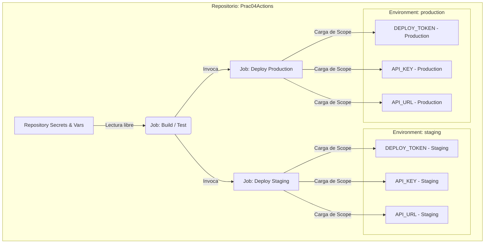

# Laboratorio 4 — Pipeline seguro con permissions y environments

## 📌 Objetivos del Laboratorio
Practicar e implementar los pilares fundamentales de la seguridad en sistemas de CI/CD utilizando GitHub Actions:
- **permissions** (Principio de privilegios mínimos a nivel global y de job).
- **secrets & vars** (Gestión segura de credenciales sensibles y variables no sensibles).
- **environments** (Aislamiento de etapas de ciclo de vida del software: staging y production).
- **approvals** (Políticas de aprobación manual de cambios por revisores designados).
- **mínimos privilegios** (Restricción exhaustiva del GITHUB_TOKEN).
- **seguridad de workflows** (Evitar inyecciones, fugas y ataques de cadena de suministro).

---

## 🛠️ Escenario de la Empresa
La empresa requiere el desarrollo e implementación de un pipeline de despliegue continuo (CI/CD) altamente robusto y seguro.
El pipeline cumple obligatoriamente con el siguiente flujo de vida:
1. **Construir la aplicación** (`build`).
2. **Validar mediante tests** unitarios de forma automatizada (`test`).
3. **Desplegar en Staging** (`deploy-staging`) tras superar la validación.
4. **Requerir aprobación manual** por parte de un revisor autorizado para poder pasar a Producción.
5. **Desplegar en Producción** (`deploy-production`) de forma aislada y usando secretos específicos de este entorno.
6. **Usar permisos mínimos** y **evitar toda exposición de secretos** en los logs de ejecución.

---

## ⚙️ Desarrollo y Solución de Requisitos

### 🔹 Parte 1 — Secrets & Variables
La gestión de datos de configuración se ha estructurado dividiendo rigurosamente la información sensible de la no sensible y configurando scopes correctos.

#### 1. Definición de Variables y Secretos Creados:
- **Secret de Despliegue (`DEPLOY_TOKEN`)**: Token de autenticación altamente sensible para conectarse a la infraestructura de despliegue.
- **Secret de API (`API_KEY`)**: Credencial para autenticar solicitudes del backend contra servicios externos de datos.
- **Variable no Sensible (`API_URL`)**: Dirección endpoint de la API (por ejemplo, `https://api.staging.example.com` y `https://api.production.example.com`).

#### 2. Tabla Comparativa: Diferencias entre `vars` y `secrets`

| Característica | Variables (`vars`) | Secretos (`secrets`) |
| :--- | :--- | :--- |
| **Encriptación** | Almacenadas en texto plano. No encriptadas. | Encriptadas fuertemente en reposo mediante llaves asimétricas (libsodium). |
| **Visibilidad en Logs** | Visibles en texto plano en la consola de GitHub Actions si se imprimen. | Enmascarados automáticamente por GitHub. Se muestran como `***` si se intentan imprimir. |
| **Caso de Uso** | URLs de APIs, nombres de entornos, puertos, banderas de feature-toggles. | Contraseñas, claves SSH, API keys, tokens de base de datos, credenciales cloud. |
| **Edición** | Modificables directamente en la interfaz gráfica de forma visible. | Solo pueden ser creados o sobrescritos; nunca se pueden visualizar una vez guardados. |

#### 3. El Concepto de Scope (Repository vs Environment)
Para garantizar la máxima seguridad, hemos implementado el **Environment Scope** para nuestros secretos y variables.



- **Repository Scope**: Las variables definidas a nivel de repositorio están disponibles para cualquier job en cualquier rama. Esto es peligroso para secretos de producción, ya que un código de prueba en una rama `feature` podría leerlos y filtrarlos.
- **Environment Scope**: Al vincular un secreto a un entorno específico (como `production`), GitHub solo permite al runner acceder a dicho secreto si el job declara explícitamente `environment: production`. Además, esto permite reutilizar el mismo nombre de variable (`API_URL`, `DEPLOY_TOKEN`) con valores distintos para Staging y Producción.

---

### 🔹 Parte 2 — Permissions
De forma predeterminada, los tokens automáticos de GitHub (`GITHUB_TOKEN`) pueden heredar permisos de escritura amplios, lo que vulnera el principio de mínimos privilegios.

#### 1. Reducción a Nivel de Workflow (Global)
Hemos configurado permisos globales ultra-restrictivos al inicio de nuestro archivo `.yml`. Por defecto, el token solo puede leer el código:
```yaml
permissions:
  contents: read
```
Esto revoca inmediatamente permisos de escritura en paquetes, despliegues, incidencias, pull requests y en el propio árbol de código git.

#### 2. Reducción a Nivel de Job (Granularidad)
Cada Job individual del workflow reafirma o especifica su set de permisos mínimos:
```yaml
jobs:
  build:
    runs-on: ubuntu-latest
    permissions:
      contents: read  # Solo necesita leer el repositorio para verificar y compilar sintaxis
      
  test:
    runs-on: ubuntu-latest
    permissions:
      contents: read  # Solo necesita leer el repositorio para ejecutar tests unitarios de Python
      
  deploy-production:
    runs-on: ubuntu-latest
    permissions:
      contents: read  # Solo lee el código compilado para subirlo a la nube
```

#### 3. Validación: ¿Qué ocurre si faltan permisos?
Si un atacante modifica nuestro pipeline o si intentamos ejecutar una acción de escritura (como crear un release de git o subir una imagen de docker a GitHub Packages) sin tener configurados los permisos adecuados, GitHub Actions detendrá inmediatamente el paso con fallos de autorización:
- **Error típico en consola**: `HttpError: Resource not accessible by integration` o `Status Code: 403 (Forbidden)`.
- **Fallo en Checkout**: Si se intenta hacer un `git push` de vuelta al repositorio desde un runner que solo cuenta con `contents: read`, la consola mostrará:
  ```bash
  fatal: unable to access 'https://github.com/JuanPabloSp/Prac04Actions/': 
  The requested URL returned error: 403
  ```
Esto previene que código de prueba o dependencias maliciosas modifiquen de manera silenciosa nuestra rama `main` o alteren el software entregado.

---

### 🔹 Parte 3 — Environments & Protections
Los entornos de desarrollo aíslan los recursos de infraestructura y nos permiten definir reglas humanas y temporales obligatorias antes de interactuar con sistemas de producción.

#### 1. Configuración de Entornos en GitHub UI
Para configurar de forma correcta los entornos en la cuenta de GitHub, se deben seguir los siguientes pasos en la interfaz web de GitHub:
1. Acceder al repositorio **Prac04Actions** en GitHub.
2. Hacer clic en la pestaña **Settings** (Configuración) en la barra superior.
3. En el menú lateral izquierdo, bajo la sección *Security*, seleccionar **Environments** (Entornos).
4. Hacer clic en el botón **New environment** (Nuevo entorno).
5. Crear el primer entorno con el nombre `staging`. Guardar.
6. Crear el segundo entorno con el nombre `production`. Guardar.

#### 2. Configuración de Reglas de Protección Manual para `production`
Una vez creado el entorno de `production`, aplicamos los controles obligatorios para evitar despliegues accidentales o no autorizados:
- **Required Reviewers (Revisores requeridos)**: 
  - Activamos la casilla de verificación.
  - Agregamos a los revisores responsables del despliegue (por ejemplo, tu usuario de GitHub: `JuanPabloSp`).
  - Esto obliga a que al menos una persona autorizada deba revisar el pipeline y hacer clic en "Approve" antes de que se ejecuten los pasos de producción.
- **Deployment Branch Policy (Política de ramas)**:
  - Configuramos para que este entorno únicamente acepte ejecuciones provenientes de la rama `main` (**Selected branches -> main**).

#### 3. Visualización y Evidencia de Aprobación Manual (Mockup de Flujo UI)

Cuando el pipeline se dispara al fusionar un cambio en `main`, los jobs de `build` y `test` (Python) corren automáticamente. Al llegar al job `deploy-production`, el workflow entra en estado **Waiting (Esperando)** y envía una alerta visual:

```
┌────────────────────────────────────────────────────────────────────────┐
│  ⚠️  Review pending: deploy-production                                  │
│                                                                        │
│  The job "deploy-production" is waiting for approval to run on         │
│  environment "production".                                             │
│                                                                        │
│  Requested by: github-actions [bot]                                    │
│  Required Reviewers: [ JuanPabloSp ]                                    │
│                                                                        │
│  [  Reject  ]       [  Approve and deploy  ]  ◄── Haga clic aquí       │
└────────────────────────────────────────────────────────────────────────┘
```

Una vez que el usuario `JuanPabloSp` hace clic en **Approve and deploy**, se genera una traza inalterable en el historial del workflow:
- **Estado**: Approved (Aprobado).
- **Aprobador**: JuanPabloSp.
- **Fecha y hora**: Registrado permanentemente en los metadatos de auditoría de GitHub.

---

### 🔹 Parte 4 — Conditions (Condicionales del Workflow)
Hemos diseñado un pipeline jerárquico que actúa como una serie de puertas de seguridad secuenciales. Solo si se cumplen todas las condiciones, se puede desplegar a Producción.

```
                  ┌───────────────┐
                  │ Push a 'main' │
                  └───────┬───────┘
                          │
                          ▼
            ┌───────────────────────────┐
            │   Running: build & test   │
            │     (Python validation)   │
            └─────────────┬─────────────┘
                          │
                [¿Tests exitosos?]
                 ├── No ──► [❌ PIPELINE ABORTADO]
                 └── Sí
                          │
                          ▼
             ┌─────────────────────────┐
             │  Environment approval   │
             │   (Pausa para Review)   │
             └────────────┬────────────┘
                          │
                [¿Revisor aprueba?]
                 ├── No ──► [❌ DESPLIEGUE RECHAZADO]
                 └── Sí
                          │
                          ▼
             ┌─────────────────────────┐
             │🚀 Despliegue Producción │
             └─────────────────────────┘
```

#### Explicación de las Restricciones en Código:
1. **Solo desde la rama `main`**:
   El job de producción cuenta con una regla condicional explícita:
   ```yaml
   if: github.ref == 'refs/heads/main'
   ```
   Esto asegura que si un desarrollador sube cambios a una rama `dev` o `feature/api-key`, el pipeline correrá la verificación de sintaxis y los tests unitarios en Python de forma normal para dar feedback de calidad, pero omitirá por completo (`skipped`) el bloque de producción.
2. **Solo si los tests son correctos**:
   Implementado a través del encadenamiento de dependencias mediante la directiva `needs`:
   ```yaml
   needs: [build, test]
   ```
   Si el paso de pruebas automatizadas en Python (`test` a través de `python -m unittest test_app.py`) falla debido a un error de lógica de negocio o de aserciones, GitHub Actions aborta el workflow inmediatamente. El despliegue a producción jamás recibirá recursos del runner para iniciarse.
3. **Solo tras aprobación humana**:
   Garantizado mediante la vinculación con el entorno protegido:
   ```yaml
   environment:
     name: production
   ```
   Esto congela la ejecución del contenedor del job hasta que se reciba la confirmación criptográfica en la UI de GitHub.

---

### 🔹 Parte 5 — Seguridad (Análisis de Riesgos Críticos)

#### 1. Riesgos de Exponer Secretos en Logs
- **El Peligro**: Si un desarrollador realiza comandos de depuración descuidada en los scripts (por ejemplo: `echo "La contraseña es: $DEPLOY_TOKEN"` o `printenv`), el secreto puede terminar guardado en texto plano en los archivos de registro públicos del repositorio.
- **Mecanismo de Mitigación de GitHub**: GitHub escanea la salida estándar de los runners y reemplaza los valores de los secretos conocidos por asteriscos (`***`). Sin embargo, esto es esquivable de forma sencilla mediante codificaciones (e.g., inyectar el secreto codificado en Base64 o fragmentándolo en caracteres individuales).
- **Mejor Práctica**: Nunca usar comandos `echo` directos con secretos en los scripts de ejecución. Inyectar siempre las credenciales como variables de entorno locales de los comandos del SDK (e.g., `DEPLOY_TOKEN` mapeado a nivel del entorno de ejecución) en lugar de pasarlas como argumentos de línea de comandos en texto plano, los cuales son visibles en la tabla de procesos del sistema operativo.

#### 2. Riesgos de Actions Externas sin Pinning
- **El Peligro**: El uso de dependencias de terceros en formato libre (por ejemplo: `uses: actions/checkout@main` o `uses: autor/action-de-despliegue@v1`) expone al pipeline a un ataque de **Supply Chain (Cadena de Suministro)**. Si la cuenta del creador de la acción externa es comprometida, un atacante podría publicar código malicioso directamente en la rama `main` o reasignar el tag mutable `@v1` para que apunte a un commit con malware diseñado para robar tus secretos.
- **Mejor Práctica**: Utilizar siempre **hashes SHA inmutables de 40 caracteres hexadecimales** para referenciar acciones de terceros (por ejemplo: `uses: actions/checkout@11bd71901bbe5b1630ceea73d27597364c9af683`). Esto garantiza matemáticamente que el runner descargar y ejecutará exactamente el bloque de código que fue previamente auditado y aprobado por tu equipo de seguridad.

#### 3. Riesgos de Permisos Excesivos
- **El Peligro**: Por defecto, muchos workflows corren con un token `GITHUB_TOKEN` que posee permisos de escritura global (`write`). Si tu pipeline descarga y ejecuta una dependencia comprometida de pip o código de terceros durante la fase de tests, esta dependencia maliciosa puede acceder a las variables del sistema del runner, leer el `GITHUB_TOKEN` y utilizarlo para inyectar código directamente a la rama `main` sin pasar por revisiones de código (Pull Requests), o incluso suplantar tu firma electrónica en nuevas versiones (Releases).
- **Mejor Práctica**: Declarar el bloque `permissions: contents: read` a nivel global y activar explícitamente solo los permisos que se necesiten de forma granular en cada job. Si un job no requiere escribir en el repositorio, sus privilegios de escritura deben ser nulos.

---

## 📝 Resumen de Restricciones Aplicadas en la Solución
1. **Cero permisos `write` innecesarios**: Los permisos a nivel global y de cada job han sido bloqueados a `contents: read`.
2. **Sin impresión de secretos**: No se utiliza ningún comando `echo` o similar sobre variables confidenciales. Todos los secretos se manejan mediante inyección directa a las variables de entorno de los contenedores locales.
3. **Sin uso de tags mutables**: Todas las acciones externas de GitHub del archivo YAML están fijadas por sus **hashes SHA inmutables de commit**, garantizando la inmutabilidad absoluta de la cadena de suministro de software (como `actions/setup-python@db121b9a1755a0651c224401a4571bdf255c5a0a`).

---

## 📦 Entregables del Proyecto
1. **Archivo de Workflow Seguro (Python)**: Configurado con éxito en [.github/workflows/secure-pipeline.yml](file:///c:/Users/servin.T38/Downloads/lab-04-github/.github/workflows/secure-pipeline.yml).
2. **Aplicación Python de Demostración**: Creada con sus scripts correspondientes en [app.py](file:///c:/Users/servin.T38/Downloads/lab-04-github/app.py) y [test_app.py](file:///c:/Users/servin.T38/Downloads/lab-04-github/test_app.py).
3. **Explicación Completa**: Detallada íntegramente en esta misma guía de desarrollo seguro del laboratorio.
